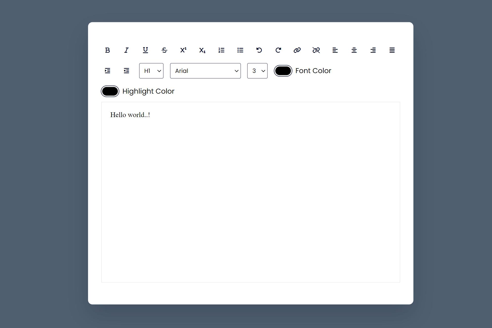

## Text Editor
This repository contains a text editor project developed using HTML, CSS, and JavaScript, created as part of my internship at CodeClause.

## Overview:
This project is part of the web development internship with CodeClause. The task involves creating a simple yet functional text editor using HTML, CSS, and JavaScript. The project aims to showcase your skills in front-end web development and your ability to create a user-friendly web application.



## Task Requirements
1. Front-End Development: Utilize HTML, CSS, and JavaScript to create the user interface and functionality of the text editor.

2. Basic Text Editing: Implement features for basic text editing such as typing, deleting, selecting, and formatting text.

3. Responsive Design: Ensure that the text editor is fully responsive, providing an optimal user experience on various devices, including desktops, tablets, and smartphones.

4. UI Design: Create a clean and intuitive user interface for the text editor.

## Project Structure
The project structure is organized as follows:

1. `index.html`: The main HTML file containing the structure and layout of the text editor.

2. `style.css`: CSS file for styling the text editor.

3. `script.js`: JavaScript file for implementing the functionality of the text editor, including text editing and user interactions.

4. `Image/`: Directory to store any images or media used in the project.

5.`README.md`: This file, providing an overview and description of the project.

## Technologies Used
- HTML5: Used for structuring the text editor.
- CSS3: Applied for styling and responsive design.
- JavaScript: Implemented client-side text editing functionality and user interactions.


## Usage
To use the text editor, simply open the index.html file in a web browser. Customize and edit text as needed.


## Getting Started

To get started with the Text Editor web application, follow these steps:

1. Clone the repository to your local machine:

   ```bash
   git clone https://github.com/HariR1893/CODECLAUSE-TEXT-EDITOR.git
   ```
2. Navigate to the project directory:
   `cd CODECLAUSE-TEXT-EDITOR`

3. Start the development server:
    `npm run start`
   
5. The app will open in your default web browser at `http://localhost:3000.`

Feel free to explore and customize this project as you see fit. It's a great way to gain practical experience in web development during your internship at CodeClause!